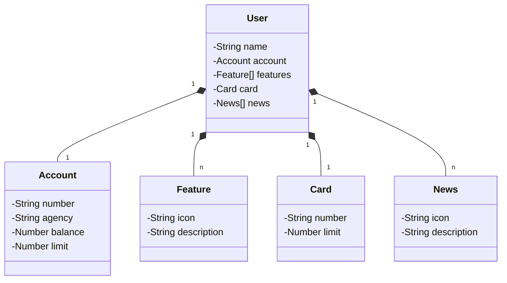

# Santander Dev Week API

## Sobre o projeto

##### [Santander API](https://michael-santander-api-prod.up.railway.app/swagger-ui/index.html) Este projeto foi desenvolvido durante o treinamento educacional da DIO na formacao Claro - Java com Spring Boot.

## :hammer: Tecnologias utilizadas
- `Java 17:` 
- `Spring Boot 3:` 
- `Spring Data JPA:` 
- `Lombok:` 
- `OpenAPI (Swagger):` 
- `PostgreSQL/H2:` 
- `Railway:` facilita o deploy e monitoramento de nossas soluções na nuvem, além de oferecer diversos bancos de dados como serviço e pipelines de CI/CD.
Link do Figma
## [Link do Figma](https://www.figma.com/design/0ZsjwjsYlYd3timxqMWlbj/SANTANDER---Projeto-Web%2FMobile?node-id=0-1&t=o4YkkfKo9LLsaa7h-0) 
foi utilizado para a abstração do domínio desta API, sendo útil na análise e projeto da solução.
## Diagrama de classes

## 

  
  

