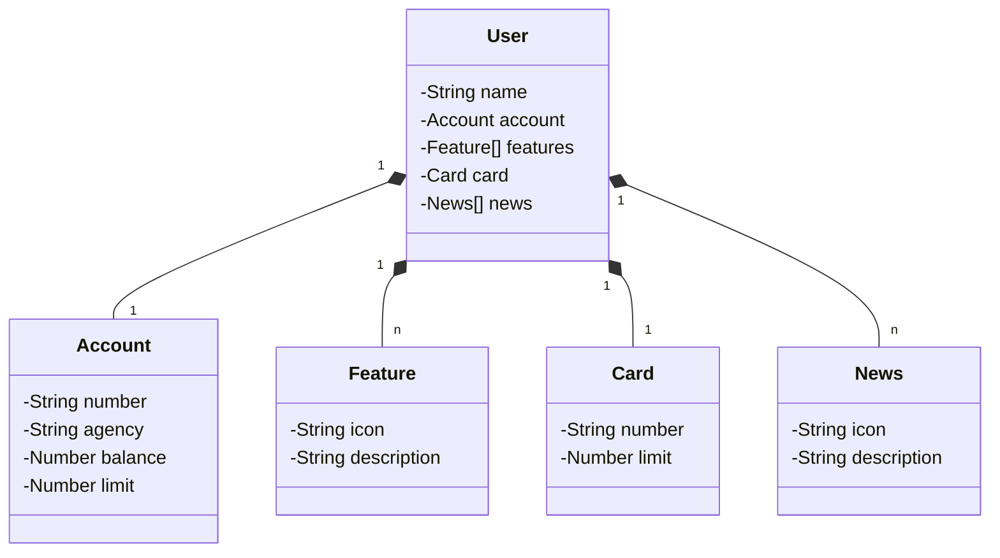

# Santander Dev Week API
Java RESTful API
## :hammer: Tecnologias utilizadas
- `Java 17:` Utilizaremos a versão LTS mais recente do Java para tirar vantagem das últimas inovações que essa linguagem robusta e amplamente utilizada oferece;
- `Spring Boot 3:` Trabalharemos com a mais nova versão do Spring Boot, que maximiza a produtividade do desenvolvedor por meio de sua poderosa premissa de autoconfiguração;
- `Spring Data JPA:` Exploraremos como essa ferramenta pode simplificar nossa camada de acesso aos dados, facilitando a integração com bancos de dados SQL;
- `Lombok:` com objetivo reduzir o código boilerplate no projeto, tornando o código mais conciso e legível.
- `OpenAPI (Swagger):` Vamos criar uma documentação de API eficaz e fácil de entender usando a OpenAPI (Swagger), perfeitamente alinhada com a alta produtividade que o Spring Boot oferece;
- `Banco de dados:` Postgresql
- `Railway:` facilita o deploy e monitoramento de nossas soluções na nuvem, além de oferecer diversos bancos de dados como serviço e pipelines de CI/CD.
Link do Figma
## [Link do Figma](https://www.figma.com/design/0ZsjwjsYlYd3timxqMWlbj/SANTANDER---Projeto-Web%2FMobile?node-id=0-1&t=o4YkkfKo9LLsaa7h-0) 
foi utilizado para a abstração do domínio desta API, sendo útil na análise e projeto da solução.
## Diagrama de classes

# IMPORTANTE
Este projeto foi desenvolvido durante o treinamento educacional da DIO na formacao Claro - Java com Spring Boot. 
